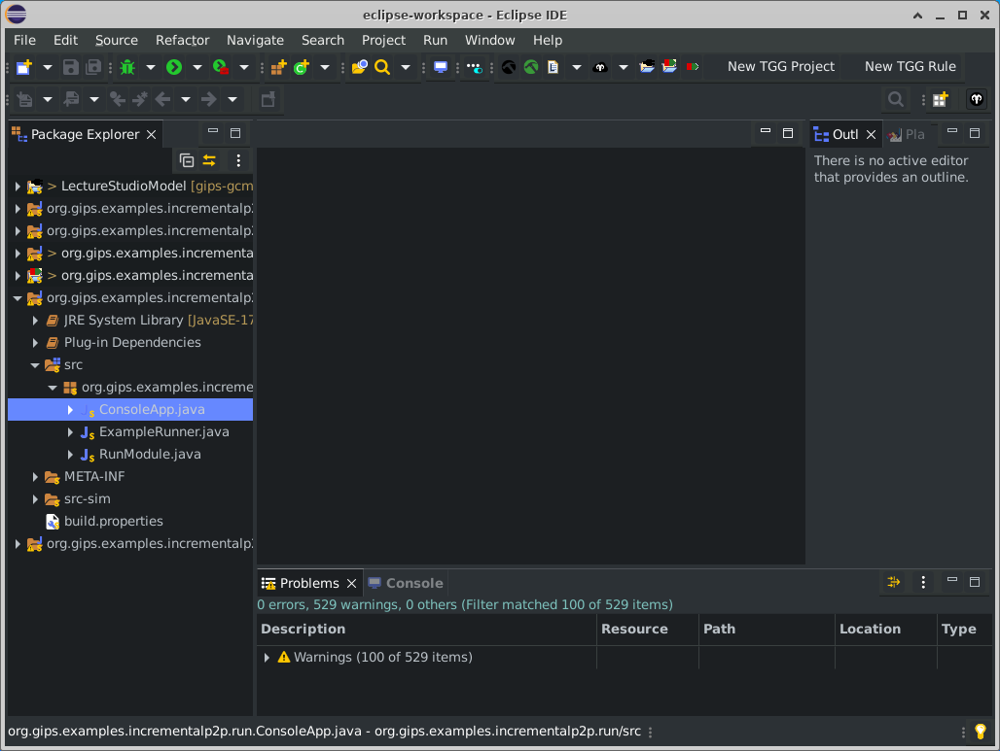

# GCM 2023 Artifact - GIPS Framework and Scenario

In the following, you will find all the necessary steps to reproduce the results and run the **lectureStudio scenario** on your own system.
For this purpose, we created a Virtual Machine (VM) to ease the installation.

## VM Setup

1. Please download the VM template and extract it, e.g., using [7zip](https://7-zip.org/).
2. Install [VirtualBox](https://www.virtualbox.org/wiki/Downloads). This hypervisor is used to run the VM on your system.
3. Start VirtualBox after the installation and press the `Import` button.  
{ width=440px }  
4. Navigate to the extracted VM folder and open `gips.ova`. This is the VM template that you are going to import in the next step.  
{ width=440px }  
5. Click on `Next` to start the configuration of your import.  
{ width=500px }  
	- **Memory**
		- You can configure the base memory with the setting `RAM`. For optimal performance, you should choose this value close to, e.g., 3/4 of your physical system memory.
			- Do not provision all of your RAM to the VM - keep at least 2-4 GiB available for your host system.
		- Keep in mind that you need at least 4 GiB of RAM to run the VM.
	- **CPU**
		- You can choose as many CPU cores as you can spare at `CPU`. GIPS relies on a pattern matching engine that highly benefits from an increased number of cores.
	- All of these settings can also be changed after the import process in `Settings`/`System`/{`Motherboard`, `Processor`}.
6. Click on `Import` to trigger the actual import process.  
{ width=500px }  
7. You should now see the VM in the upper left corner and a description of the configured system. 
{ width=500px }  
8. Select the VM and press `Start`. When asked for a password use `vagrant` to log in.
	- The VM will show you a popup right after the first login regarding an upgrade to "Ubuntu 22.04". You can safely click on `Dont Upgrade` and continue with the next steps.

\newpage

## Starting the GIPS Eclipse Environment

Follow these steps to open the pre-installed GIPS development environment:

- You will find a shortcut `GIPS Eclipse`. Double-click on it to start the Eclipse installation.
	- If this is the first time you started the Eclipse installation, it will show you a few dialogues after the initial start-up:  
	{ width=360px }  
	- Click on `Next`.  
	{ width=360px }  
	- Choose your preferred theme. (We recommend `Darkest Dark Theme`.) Click on `Next`.  
	{ width=440px }  
	- In this window, you can choose a workspace. The pre-configured workspace is the default one selected (`eclipse-workspace - /home/vagrant`). Click on it to finally finish the start process of Eclipse.  
	{ width=440px }  
	- Click on `Continue`.
	- Eclipse will greet you with a `Welcome` tab which you can safely close.
		- The initial start-up of Eclipse will also open the web browser to show you news about Eclipse. You can safely close the window.  
	{ width=440px }  
	- Finally, you can see the workspace directory:  
	{ width=440px }  

\newpage

## Running the Example

You need to complete two steps to successfully run the example.
The following notes will guide you through this process.

### Building and Running the Simulation

- Select all projects within the workspace.  
{ width=500px } 
- Right-click on them: Go to `eMoflon`/`Build selected projects fully`.
	- Alternative: Click on the black eMoflon hammer symbol in the toolbar at the top.
- All errors should now be gone.
	- Sometimes it is required to select all projects and press `F5` to get Eclipse to reload all generated files.
- You can now run the example by going to `org.gips.examples.incrementalp2p.run`/`src`/`org.gips.examples.incrementalp2p.run`/`ConsoleApp.java`.  
{ width=500px } 
- Right-click on this file and select `Run As`/`Java Application`.
- The simulation now starts and shows its progress on the `Console`. The runtime of this step depends on your system and the VM setup. It should not take longer than one minute.
- After the simulation has finished, Eclipse will automatically open the web browser `Firefox`.
- Maximize the window for the best user experience possible.  
{ width=550px } 

### Visualization

- The graph shows the base state of the simulation. There is one central node called `Root-Server`, multiple relay clients, and a set of normal clients in the stream.
- Your next step is to click on the button at the right in the top menu: `Remove Clients`
	- If you click on it, one of the relay clients will disconnect from the network.
- Now, one or multiple of the streaming clients do not have a connection to the network. Click on `Redistribute` to show how GIPS connected them back to the network.
- The network is in a consistent state again. Click on `Add additional clients` to make a set of new clients appear in the visualization.
- As before, the new clients are not connected to the network. Click on `Distribute additional clients` to connect them to the network.

- You have reached the end of the simulation. All clients should now be connected to the network.

**Please notice**:
This visualization is unable to interact with the simulation framework itself.
It is only able to show the results of the simulation step-by-step.
A more tightly integrated visualization, e.g., to manipulate the nodes and force a recalculation of the network afterward, is future work.

\newpage

## Implementation

The Eclipse workspace consists of the following projects:

- **LectureStudioModel**: Metamodel of the example. If you are interested in how the complete metamodel looks, open the file `LectureStudioModel.ecore` in `LectureStudioModel`/`model` and select all entries. If you open the tab `PlantUML` on the right side of the Eclipse view, you can inspect a graphical representation of the metamodel.
- **org.eclipse.examples.incrementalp2p.common**: Contains common classes to hold some data and constant definitions.
- **org.eclipse.examples.incrementalp2p.distribution**: Contains the control flow logic of the simulation and the GIPS(L) implementation. This code mainly calls the generated `API` of the GIPS(L) project.
- **org.eclipse.examples.incrementalp2p.gips.incrementaldistribution**: This is the actual GIPS(L) implementation for the incremental setup/maintenance process of the streaming network. It contains:
	- GIPSL specification: `src`/`gipsl`/`Model.gipsl`
	- GT rules: `src`/`gipsl`/`Rules.gt`
	- GT patterns: `src`/`gipsl`/`Patterns.gt`
	- GT conditions: `src`/`gipsl`/`Conditions.gt`
- **org.eclipse.examples.incrementalp2p.repository**: This project holds several GT rules to setup the simulation environment, i.e., to create the start space of the (non-connected) streaming network.
- **org.eclipse.examples.incrementalp2p.run**: Entry point (runner) of the simulation. Use the class `ConsoleApp.java` to start the simulation (via its `main` method).
- **org.eclipse.examples.incrementalp2p.visualization**: Components to generate the visualization that is shown in the web browser at the end of a run. 

\newpage

## Troubleshooting

### Problems booting the VM

- If there are problems when starting the VM, please check if there are any warnings from VirtualBox.
We recommend reading them thoroughly and solving them as recommended by the tool.
- If you get an error stating that virtualization has been deactivated for your system, you may have to activate this feature in your BIOS/UEFI.
	- If you are using Windows, you can find if virtualization is enabled via accessing the **Task Manager**/**Performance**.  
	
	- If you are using Linux, you can find out if virtualization is enabled via the terminal:  
	`$ egrep -c '(vmx|svm)' /proc/cpuinfo`  
	(The return value must be `>=1`.)
- **Error: Failed to load the NVRAM store from the file (VERR_PATH_NOT_FOUND)**: Especially in newer VirtualBox versions, we found that this error could occur. Possible solution (sorted descending regarding effort):
	- Try to reboot your computer after installing VirtualBox.
	- Try to re-install VirtualBox.
	- Try to install the [Extension pack for VirtualBox](https://www.virtualbox.org/wiki/Downloads).
	- If all the steps above could not help, try installing an older version of VirtualBox (e.g., 6.1).

### Problems/Hints for the usage of the VM

- **Adapt screen resolution**: Normally, the resolution of the virtual screen of the VM should update according to the window size you chose. However, if this does not work, you can manually change the resolution of the virtual screen.
	- Click on the blue start symbol in the top left corner.
	- Go to `Settings`/`Display`.
	- Choose a solution that fits your need and click `Apply`.
- **Change keyboard layout**: The default keyboard layout of the VM is *English (US)*. You can change this setting:
	- Click on the blue start symbol in the top left corner.
	- Go to `Settings`/`Keyboard`/`Layout`.
	- Disable the checkbox: `Use system defaults`
	- Add your preferred layout and *also remove the default one*(!).
- **Snapshots**: You can create snapshots of your VM within the VirtualBox window. This can be useful especially if you want to change settings or try out other specifications.

### Problems/Hints for Eclipse

Sometimes, Eclipse and its cache produce strange errors that cannot be solved by rebuilding all projects.
In this case, try these steps:

- **Build automatically**: Make sure that `Build Automatically` is enabled in the `Project` menu (in the top navigation bar).
- **Refresh the workspace**: Select all projects in the workspace and hit `F5`.
- **Clean the workspace**: Select all projects in the workspace, click on `Project` (in the top navigation bar)/`Clean...`, select `Clean all projects`, and click on `Clean`.

## Contact and Help

If you have any other problems running the example or the VM, feel free to open [an issue at GitHub](https://github.com/Echtzeitsysteme/gips-gcm-2023-artifact-vm/issues) or contact us directly.
